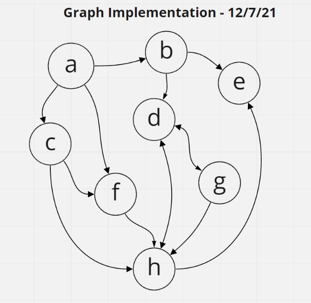

# Graph Implementation

## **Challenge**

Implement a Graph, represented as an adjacency list and include the following methods:

### `add node`

-   **Arguments**: value
-   **Returns**: The added node
-   Add a node to the graph

### `add edge`

-   **Arguments**: 2 nodes to be connected by the edge, weight (optional)
-   **Returns**: nothing
-   Adds a new edge between two nodes in the graph
-   If specified, assign a weight to the edge
-   Both nodes should already be in the Graph

### `get nodes`

-   **Arguments**: none
-   **Returns**: all of the nodes in the graph as a collection (set, list, or similar)

### `get neighbors`

-   **Arguments**: node
-   **Returns**: a collection of edges connected to the given node
-   Include the weight of the connection in the returned collection

### `size`

-   **Arguments**: none
-   **Returns**: total number of nodes in the graph

---

## **Testing**

Jest testing was used to verify that:

-   a node can be successfully added to the graph <--- _thank you to Justin Hamerly for helping me stop spinning my wheels on this one!_
-   an edge can be successfully added to the graph
-   a collection of all nodes can be properly retrieved from the graph
-   all appropriate neighbors can be retrieved from the graph
-   neighbors are returned with the weight between nodes included
-   proper size is returned, representing the number of nodes in the graph
-   a graph with only one node and edge can be properly returned
-   an empty graph properly returns null

---

## Graph

